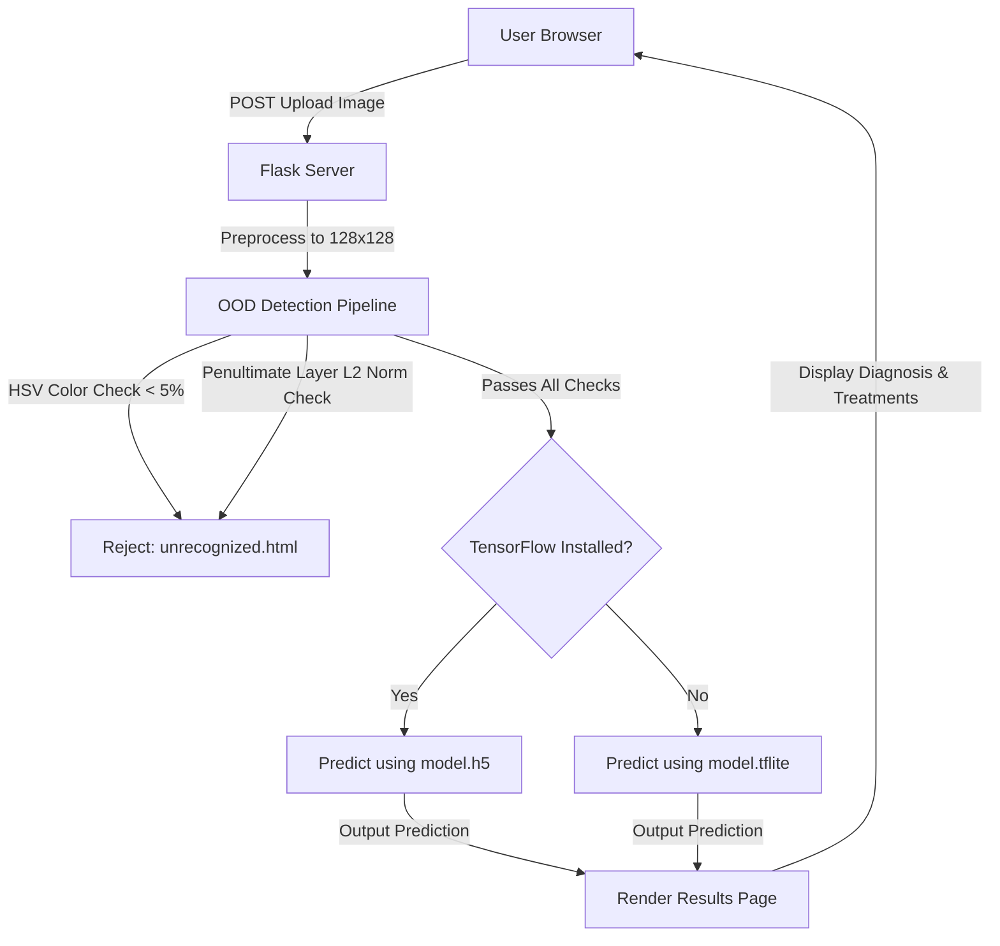

# 🍅 Tomato Leaf Care — Plant Disease Prediction System

A modern, deep learning-powered web application designed to help farmers, agronomists, and garden enthusiasts instantly diagnose tomato leaf diseases and receive actionable, science-backed organic and chemical treatment recommendations.


---

## 🌟 Key Features

1. **Instant AI Diagnosis:** Upload a close-up image of a tomato leaf, and the custom deep learning model classifies it into one of 10 categories (9 diseases + healthy state) in milliseconds.
2. **Robust Out-of-Distribution (OOD) Verification:** Integrated multi-stage safety filters prevent false positives from non-leaf images or unrelated content:
   * **Color Check (HSV):** Uses OpenCV to ensure the image contains at least 5% foliage tones (greens, yellows, and browns).
   * **Feature Activation Check:** Inspects the L2 Norm, Mean, and Max activation values at the neural network's penultimate layer to mathematically reject out-of-distribution patterns (e.g., rejecting an image of a green car or animal).
3. **Actionable Treatments:** Provides detailed, organic, and chemical treatment routines for every diagnosed disease.
4. **Modern Glassmorphism UI:** A premium user interface built with frosted-glass containers, side-by-side image comparisons, and fully responsive layouts.
5. **Resource-Optimized Fallback:** Native support for `tflite-runtime` allows the application to automatically fall back to TensorFlow Lite inference if full TensorFlow is not installed, enabling deployment on low-memory servers (like the PythonAnywhere Free Tier).

---

## 🛠️ Technical Architecture

The following diagram illustrates the application's processing flow and prediction pipeline:



### Stack Detail
* **Frontend:** HTML5, CSS3 (Custom Glassmorphism CSS design system in `glass.css`), Bootstrap 4.5.1, Vanilla JavaScript.
* **Backend:** Python 3, Flask framework.
* **Computer Vision:** OpenCV (`cv2`) for HSV color masking and foliage verification.
* **Deep Learning Inference:**
  * **Primary:** TensorFlow/Keras (`model.h5` sequential CNN).
  * **Lightweight Fallback:** TensorFlow Lite (`model.tflite` quantized model) for resource-constrained environments.

---

## 📋 Supported Disease Categories

The neural network is trained to identify the following conditions:

| Diagnosis Label | Status | Example Treatment Approach |
| :--- | :--- | :--- |
| **Healthy and Fresh** | Clean Foliage | N/A (Maintain regular watering & soil health) |
| **Bacteria Spot Disease** | Infected | Copper-based bactericide sprays |
| **Early Blight Disease** | Infected | Liquid Copper / Organic bio-fungicides |
| **Late Blight Disease** | Infected | Immediate organic/chemical fungicide intervention |
| **Leaf Mold Disease** | Infected | Pruning, drip irrigation, increasing airflow |
| **Septoria Leaf Spot** | Infected | Potassium bicarbonate, Chlorothalonil |
| **Target Spot Disease** | Infected | Mancozeb, copper oxychloride |
| **Tomato Mosaic Virus** | Infected | Eradication of infected plants (Preventative tools only) |
| **Yellow Leaf Curl Virus** | Infected | Insecticidal soaps for whiteflies, Neem oil |
| **Two Spotted Spider Mite** | Infected | Bifenazate, selective miticides, predatory mites |

---

## 📂 Directory Structure

```text
├── leaf.py                             # Core Flask application and prediction logic
├── requirements.txt                    # Python dependencies
├── .gitignore                          # Excludes datasets, environments, and cache files
├── pythonanywhere_deployment_guide.md  # Detailed cloud deployment guide (Quick)
├── pythonanywhere_deployment_guide2.md # Complete step-by-step deployment checklist
├── convert_to_tflite.py                # Model conversion script (h5 -> tflite)
├── rebuild_templates.py                # Utility to maintain HTML layouts
├── verify_routing.py                   # Automated routing and prediction validation tests
├── model.h5                            # Full TensorFlow Keras model (44MB)
├── model.tflite                        # Quantized TF Lite model (14.8MB)
├── my_model_weights.h5                 # Keras model weights (14.8MB)
├── model1.json                         # Model architecture in JSON format
├── extracted_details.json              # Extracted disease metadata
├── static/
│   ├── css/                            # Bootstrap and Custom Glassmorphism styles
│   ├── images/                         # UI images and disease reference illustrations
│   └── upload/                         # Temporary folder for user-uploaded leaf images
└── templates/
    ├── index.html                      # Landing & upload interface
    ├── unrecognized.html               # OOD Rejection error page
    └── Tomato-*.html                   # 10 specific disease diagnosis result pages
```

---

## 🚀 Running Locally

### Prerequisites
Make sure Python 3.9 - 3.11 is installed on your machine.

1. **Clone the Repository:**
   ```bash
   git clone https://github.com/yourusername/tomato-leaf-disease-detection.git
   cd tomato-leaf-disease-detection
   ```

2. **Create a Virtual Environment:**
   * **Windows:**
     ```powershell
     python -m venv venv
     .\venv\Scripts\activate
     ```
   * **macOS/Linux:**
     ```bash
     python3 -m venv venv
     source venv/bin/activate
     ```

3. **Install Dependencies:**
   ```bash
   pip install -r requirements.txt
   ```

4. **Start the Web Server:**
   ```bash
   python leaf.py
   ```

5. **Access the Interface:**
   Open your browser and navigate to `http://127.0.0.1:5001`.

6. **Run Verification Tests:**
   Ensure all prediction and OOD paths are working properly by executing:
   ```bash
   python verify_routing.py
   ```

---

## ☁️ Deployment (PythonAnywhere)

Deploying deep learning models to free cloud tiers can be challenging due to disk space limits (e.g., 512MB on PythonAnywhere). 

This project solves this by using a **TFLite fallback mechanism** inside `leaf.py`. By running with `tflite-runtime` and `opencv-python-headless`, the app avoids loading the heavy `tensorflow` library, reducing memory usage and staying well under disk limits.

* For a quick guide, read the [PythonAnywhere Deployment Guide](pythonanywhere_deployment_guide.md).
* For a comprehensive checklist, follow the [Detailed Deployment Guide](pythonanywhere_deployment_guide2.md).

---

## 📝 License & Open Source

This project is open-source. Feel free to use, modify, and distribute it for educational, commercial, or research purposes.
