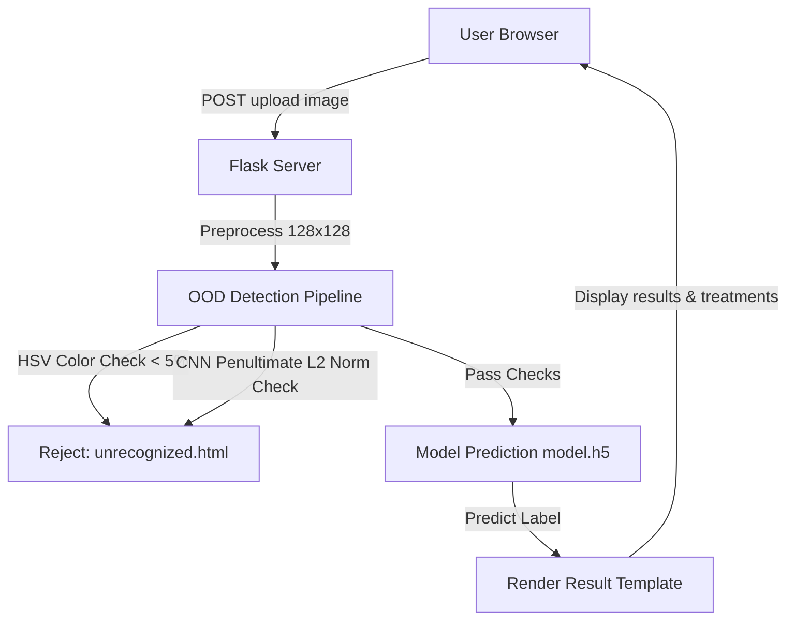

# Tomato Leaf Care - Plant Disease Prediction System

A modern, local, deep learning-powered web application designed to help farmers, agronomists, and garden enthusiasts diagnose tomato leaf diseases and get organic/chemical treatment recommendations instantly.

---

## 🌟 Key Features

1.  **Instant AI Diagnosis:** Upload a close-up image of a tomato leaf, and the deep learning model classifies it into one of 10 categories (9 diseases + healthy state) in milliseconds.
2.  **Out-of-Distribution (OOD) Verification:** Integrated safety filters prevent false positives from non-leaf images or unrelated content:
    *   **Color Check (HSV):** Ensures the image contains at least 5% foliage tones (greens, yellows, and browns).
    *   **Feature Activation Check:** Checks internal activation values at the neural network's penultimate layer to reject out-of-distribution patterns (like green cars or background images).
3.  **Modern Glassmorphism UI:** Features a high-end interface built with frosted-glass containers, clear layouts, side-by-side image comparisons, and responsive CSS.
4.  **100% Offline & Local:** Fully functional offline. All assets (Bootstrap CSS, custom stylesheets, JS script, and model weights) are hosted locally on the server. Zero external CDN dependencies.

---

## 🛠️ Technical Stack & Architecture



*   **Frontend:** HTML5, CSS3 (Custom Glassmorphism Design System in `glass.css`), Local Bootstrap 4.5.1, and Vanilla JavaScript.
*   **Backend:** Python 3, Flask framework.
*   **Deep Learning:** TensorFlow / Keras (Sequential CNN model loading weights from `model.h5`).
*   **Computer Vision:** OpenCV (`cv2` library) for HSV color masks and color metrics.

---

## 📂 Project Directory Structure

*   `leaf.py` - Core Flask application file containing server routes, OOD verification functions, and prediction logic.
*   `requirements.txt` - File listing all dependencies (TensorFlow, OpenCV, Flask, etc.).
*   `verify_routing.py` - Verification testing script validating model classification performance and OOD rejection rates.
*   `static/` - Static directory containing:
    *   `css/bootstrap.min.css` - Local Bootstrap stylesheet.
    *   `css/glass.css` - Frost-glass styling rules.
    *   `images/` - Disease reference images and background patterns.
    *   `upload/` - Destination folder storing user-uploaded leaf images.
*   `templates/` - Output HTML layouts:
    *   `index.html` - The modern, glass-card landing and upload page.
    *   `unrecognized.html` - Error view detailing OOD rejection reasons and supported classes.
    *   `Tomato-*.html` - 10 specific results pages displaying side-by-side image comparison and treatments.

---

## 📋 Supported Tomato Categories

Our classifier identifies and suggests treatment routines for:

| Category | Diagnosis Label | Status |
| :--- | :--- | :--- |
| **Healthy** | Tomato - Healthy and Fresh | Clean Foliage |
| **Bacterial Spot** | Tomato - Bacteria Spot Disease | Infected |
| **Early Blight** | Tomato - Early Blight Disease | Infected |
| **Late Blight** | Tomato - Late Blight Disease | Infected |
| **Leaf Mold** | Tomato - Leaf Mold Disease | Infected |
| **Septoria Spot** | Tomato - Septoria Leaf Spot Disease | Infected |
| **Target Spot** | Tomato - Target Spot Disease | Infected |
| **Yellow Leaf Curl** | Tomato - Tomato Yellow Leaf Curl Virus Disease | Infected |
| **Mosaic Virus** | Tomato - Tomato Mosaic Virus Disease | Infected |
| **Spider Mites** | Tomato - Two Spotted Spider Mite Disease | Infected |

---

## 🚀 How to Run the Project

### Prerequisites
Make sure Python is installed. The project runs in the local virtual environment `Tenv`.

### Step 1: Start the Web Server
Open a terminal in the project directory and execute:
```powershell
.\Tenv\Scripts\python.exe leaf.py
```

### Step 2: Access the Interface
Open your web browser and go to:
```
http://127.0.0.1:5001
```

### Step 3: Run Verification Tests
To verify all predictions and routing logic are operating correctly:
```powershell
.\Tenv\Scripts\python.exe verify_routing.py
```
